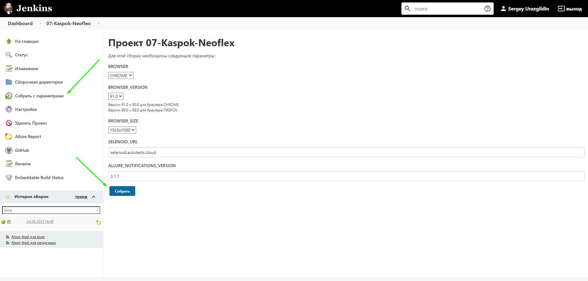
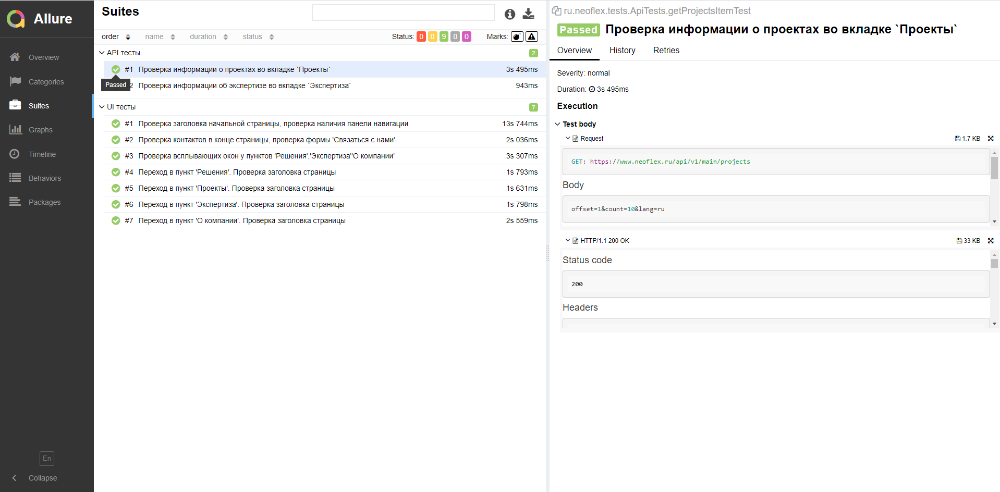
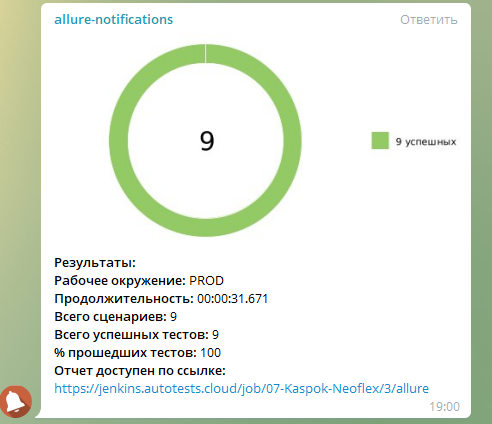

# Тесты для Neoflex - https://www.neoflex.ru


___

## Запуск тестов

### Параметры (для изменения параметров, необходимо прописать свои значения в файле local.properties):

* Браузер (chrome по умолчанию)
* Версия браузера (по умолчанию 91.0)
* Разерешение браузера (по умолчанию 1920x1080)

#### Локальный запуск тестов

```bash
gradle clean test
```

___

#### Запуск тестов через Jenkins

Задача в Jenkins - https://jenkins.autotests.cloud/job/07-Kaspok-Neoflex/

1. Авторизоваться в [Jenkins](https://jenkins.autotests.cloud/)
2. Открыть [проект](https://jenkins.autotests.cloud/job/07-Kaspok-Neoflex/)
3. Выбрать пункт "Собрать с параметрами"
4. Указать параметры или оставить параметры по умолчанию, нажать "Собрать"
   

___

## Результаты пройденных тестов

Сформировать отчет в Allure локально можно командой:

```bash
./gradlew allureServe
```

___

### Анализ результатов в Allure после запуска тестов через Jenkins

Отчетом в Allure можно ознакомится по [ссылке](https://jenkins.autotests.cloud/job/07-Kaspok-Neoflex/3/allure/)



___

### Уведомления в Telegram после пройденных тестов

